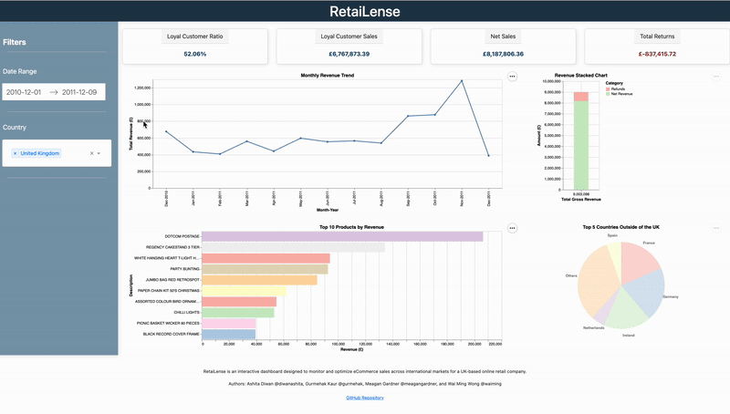

# RetaiLense

Authors: Ashita Diwan @diwanashita, Gurmehak Kaur @gurmehak, Meagan Gardner @meagangardner, and Wai Ming Wong @waiming

## About RetaiLense
**RetaiLense** is an interactive dashboard designed to monitor and optimize eCommerce sales across international markets for a UK-based online retail company. It provides insights into global revenue, seasonal trends, top-selling products, and regional performance, helping identify growth opportunities in different countries. By analyzing product demand, return data, and country-specific performance, users can make informed decisions to drive international expansion and optimize sales strategies.

## Motivation

### Problem:
Retail businesses often struggle to quickly analyze and visualize their sales data, making it difficult to identify trends, top-performing products, and revenue patterns across different countries and time periods.

### Solution:
Our dashboard provides an intuitive interface to explore retail data through various visualizations:
- Bar chart to show top products by revenue
- Revenue trend analysis over time
- Waterfall chart to show gross revenue, refunds, and net revenue
- Metric cards to show Key Performance Indicators (KPI)
- Pie chart to show geographic distribution of sales

### How to use this app
This dashboard features the following interactive filters:
- Date range selection
- Country selection
- Multiple visualization components that update dynamically based on the selected filters



## Running the dashboard locally

### 1. Clone the repository
```bash
git clone https://github.com/UBC-MDS/DSCI-532_2025_9_RetaiLense.git
cd DSCI-532_2025_9_RetaiLense
```

### 2. Create a virtual environment and activate it
```bash
conda env create -f environment.yml
conda activate retailense
```

### 3. Render the dashboard locally
```bash         
python src/app.py
```

### 4. Click on the link from the output or copy and paste it into a browser to view the dashboard
Your output should look something like below. The exact numbers may be different.
```bash
Dash is running on http://127.0.0.1:8050/
```

## How can I get involved?
If you have any feedback or input for our team, please get into contact with us by creating a [new issue](https://github.com/UBC-MDS/DSCI-532_2025_9_RetaiLense/issues/new). More instructions on contributing can be found [here](https://github.com/UBC-MDS/DSCI-532_2025_9_RetaiLense/blob/main/CONTRIBUTING.md). Please abide by our [code of conduct](https://github.com/UBC-MDS/DSCI-532_2025_9_RetaiLense/blob/main/CODE_OF_CONDUCT.md) when contributing to our project.
